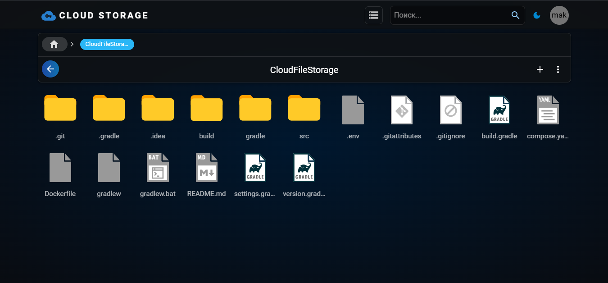

# Проект "Облачное хранилище файлов"

Многопользовательское файловое облако. Пользователи сервиса могут использовать его для загрузки и хранения файлов. 
Источником вдохновения для проекта является Google Drive.

## Функционал приложения

**Работа с пользователями:**
* Регистрация
* Авторизация
* Logout

**Работа с файлами и папками:**
* Загрузка файлов и папок
* Создание новой пустой папки
* Удаление
* Переименование и перемещение
* Скачивание файлов и папок
* Максимальный допустимый размер файла - 100МВ
* Максимальный допустимый размер папки - 100МВ

## Запуск приложения

1. Скачать Zip-архив проекта по данной [ссылке](https://github.com/makson4986/CloudFileStorage/archive/refs/heads/master.zip)  
Либо же клонировать репозиторий  
`git clone https://github.com/makson4986/CloudFileStorage.git`
2. Скачать Zip-архив frontend'а по данной [ссылке](https://github.com/makson4986/CloudFileStorageFrontend/archive/refs/heads/master.zip)  
Либо же клонировать репозиторий  
`git clone https://github.com/makson4986/CloudFileStorageFrontend.git`
3. Для запуска также необходим docker, который можно скачать по данной [ссылке](https://docs.docker.com/get-started/get-docker/)
4. В директории с проектом найдите файл **.env** и укажите свои данные, или оставьте по умолчанию.
Ниже расписано, что означает каждая переменная.
   * POSTGRES_LOGIN - логин для доступа к базе данных
   * POSTGRES_PASSWORD - пароль для базы данных
   * MINIO_LOGIN - логин для доступа к Minio
   * MINIO_PASSWORD - пароль для доступа к Minio

   Для создания нового пользователя для базы данных используйте команды ниже, вводя их от имени администратора.  
   `CREATE USER {username} WITH PASSWORD {password};`  
   `GRANT ALL PRIVILEGES ON DATABASE {database-name} TO {username};`
5. Собрать docker image для frontend. Для этого перейти в соответствующую папку и выполнить команду ниже, ее следует выполнять в той же самой папке, где лежат dockerfile.  
`docker build -t cloud_file_storage_frontend .`
6. Собрать docker image проекта и запустить контейнеры. Для этого в соответствующую папку и выполнить команду ниже, ее следует выполнять в той же самой папке, где лежат dockerfile и compose.yaml  
`docker-compose up -d --build`
7. Запущенное приложение можно найти по этому адресу - http://localhost:8080